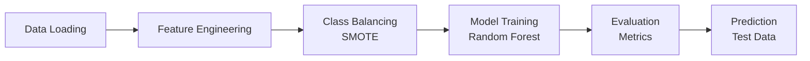

# 🔍 Scratch Detection on Semiconductor Wafers

[](https://www.python.org/downloads/)
[](https://jupyter.org/)
[](https://scikit-learn.org/)
[](https://opensource.org/licenses/MIT)

This project focuses on detecting scratches on wafer maps — identifying both faulty dies and visually good dies that are part of a physical scratch. This is important in semiconductor manufacturing to avoid using low-quality dies that may have been physically damaged.

## 🧠 Project Description

In the semiconductor industry, **"wafers"** are thin discs of semiconductor material (like silicon) used to fabricate microelectronic devices such as transistors and integrated circuits. A wafer can contain hundreds or thousands of **"dies"**, which are later diced from the wafer for use in products.

Scratches on wafers appear as **elongated clusters** of faulty dies and may also include some visually "good" dies located along a physical scratch. These may be misclassified unless explicitly detected. The goal of this project is to train a model that can predict whether a given die is part of a scratch, regardless of whether it failed electrically or not.

<div align="center">
  
  <p><em>Figure 1: A semiconductor wafer</em></p>
</div>

Scratches are manually handled today — often using a visual inspection method. This project aims to automate that detection by analyzing the **wafer map**, which includes the position and status of each die.

<div align="center">
  
  <p><em>Figure 2: Logical wafer map</em></p>
</div>

## 📊 Dataset Overview

Each row in the training data represents a single die, with:

| Column | Description |
|--------|-------------|
| `WaferName` | Wafer identifier |
| `DieX`, `DieY` | Position on the wafer |
| `IsGoodDie` | Whether the die passed electrical testing |
| `IsScratchDie` | Whether the die is part of a scratch (our target) |

> **Note:** The test set has the same structure but **does not include** the `IsScratchDie` label — your model should generate predictions for it.

## 🎯 Project Goals

- ✅ **Predict scratches** using both bad and good dies  
- ✅ **Engineer spatial features** such as neighbor defect density and distance from center  
- ✅ **Handle imbalanced data** (scratches are rare) using techniques like SMOTE  
- ✅ **Optimize model performance** based on precision, recall, and F1 score

## 📈 Business Relevance

| Benefit | Description |
|---------|-------------|
| **Automation** | Reduces cost and error in manual scratch tagging |
| **Quality Control** | Avoids sending risky dies to production |
| **Yield Optimization** | Balances minimizing ink usage with avoiding scratch risk |

## 🧪 Technologies Used

<div align="center">


</div>

- **Machine Learning**: Random Forest classifier with SMOTE for class balancing
- **Data Processing**: pandas, NumPy for data manipulation
- **Visualization**: Matplotlib for wafer map plotting
- **Environment**: Jupyter Notebook for interactive development

## 🚀 Getting Started

### Prerequisites

- Python 3.7 or higher
- Git (for cloning the repository)

### Installation

1. **Clone the repository**
   ```bash
   git clone https://github.com/your-username/scratch-detection-wafers.git
   cd scratch-detection-wafers
   ```

2. **Create virtual environment** (recommended)
   ```bash
   python -m venv venv
   source venv/bin/activate  # On Windows: venv\Scripts\activate
   ```

3. **Install dependencies**
   ```bash
   pip install -r requirements.txt
   ```

4. **Extract the data**
   - The project uses `data.zip` which contains:
     - `wafers_train.csv` - Training data with labels
     - `wafers_test.csv` - Test data without labels

### 📦 Required Dependencies

```txt
pandas>=1.3.0
numpy>=1.21.0
scikit-learn>=1.0.0
matplotlib>=3.5.0
imbalanced-learn>=0.8.0
jupyter>=1.0.0
```

## 📁 Project Structure

```
scratch-detection-wafers/
├── 📓 scratch_detection_assignment.ipynb  # Main analysis notebook
├── 📦 data.zip                           # Dataset (train & test)  
├── 📋 requirements.txt                   # Python dependencies
├── 📖 README.md                         # Project documentation
├── 📄 LICENSE                           # MIT License
└── 🖼️ assets/                           # Documentation images
    ├── wafer.jpeg                       # Wafer photo
    └── wafer_map.png                    # Wafer map diagram
```

## 🔧 Usage

### Quick Start

1. **Launch Jupyter Notebook**
   ```bash
   jupyter notebook scratch_detection_assignment.ipynb
   ```

2. **Run the analysis** by executing cells sequentially:
   - 📁 Load and explore the data
   - 📊 Visualize wafer maps
   - ⚙️ Extract spatial features
   - 🤖 Train the model
   - 📈 Evaluate performance

### 🔑 Key Features

The model uses advanced feature engineering including:

| Feature Type | Description |
|--------------|-------------|
| **Spatial Positioning** | Normalized coordinates and distance from center |
| **Directional Patterns** | Bad die ratios in horizontal, vertical, and diagonal directions |
| **Multi-radius Analysis** | Pattern detection at different scales (radius 1-3) |
| **Wafer-level Statistics** | Overall yield and defect density |

### 🔄 Model Pipeline



1. **Data Loading**: Extract training and test data from ZIP file
2. **Feature Engineering**: Create spatial and pattern-based features
3. **Class Balancing**: Apply SMOTE to handle imbalanced scratch detection
4. **Model Training**: Use Random Forest classifier
5. **Evaluation**: Assess performance using confusion matrix and classification report
6. **Prediction**: Generate predictions for test data

## 📊 Model Performance

The model addresses the challenge of highly imbalanced data where scratch dies are rare:

| Metric | Description |
|--------|-------------|
| **Class Distribution** | Original data heavily skewed toward non-scratch dies |
| **SMOTE Application** | Balances classes for better learning |
| **Evaluation Metrics** | Precision, recall, and F1-score for scratch detection |

## 🎨 Visualization Features

The project includes comprehensive visualization tools for wafer map plotting:

<div align="center">

| Color | Die Type |
|-------|----------|
| 🟢 Green | Good dies |
| 🔴 Red | Bad dies |
| 🔵 Blue | Scratch dies (bad) |
| 🟡 Yellow | Ink dies (good dies on scratch) |

</div>

## 💡 Key Insights

> **Feature Engineering**: Spatial patterns like directional bad-die ratios significantly improve detection accuracy

> **Class Imbalance**: SMOTE effectively handles the rarity of scratch dies

> **Production Considerations**: Model monitoring and retraining recommended for manufacturing process changes

## 🔮 Future Improvements

- [ ] Add features for scratch depth/severity classification
- [ ] Implement ensemble methods for improved robustness
- [ ] Develop real-time processing capabilities
- [ ] Include temporal features for process drift detection
- [ ] Deploy model as web service API
- [ ] Add automated model retraining pipeline

## 📝 Notes

> ⚠️ **Important**: The original `wafers_train.csv` file is large and stored in ZIP format

- Sample processing (100,000 dies) is used for development and testing
- Model performance should be validated on full dataset for production use
- Memory requirements may be significant for full dataset processing

## ⚠️ Important Considerations

| Consideration | Description |
|---------------|-------------|
| **Data Privacy** | Semiconductor manufacturing data may be sensitive |
| **Model Drift** | Regular retraining recommended as manufacturing processes evolve |
| **Validation** | Thorough testing required before production deployment |

## 🤝 Contributing

We welcome contributions! Please follow these steps:

1. 🍴 Fork the repository
2. 🌿 Create a feature branch (`git checkout -b feature/amazing-feature`)
3. ✨ Make your changes
4. ✅ Add tests if applicable
5. 📝 Commit your changes (`git commit -m 'Add amazing feature'`)
6. 🚀 Push to the branch (`git push origin feature/amazing-feature`)
7. 🔄 Open a Pull Request

## 📄 License

This project is licensed under the MIT License - see the [LICENSE](LICENSE) file for details.

## 🌟 Acknowledgments

- Thanks to the semiconductor industry for providing domain expertise
- Special thanks to the open-source community for the amazing tools and libraries

---

<div align="center">

**⭐ If you found this project helpful, please give it a star! ⭐**

*This project demonstrates advanced machine learning techniques for semiconductor quality control, combining domain expertise with modern data science methods.*

Made with ❤️ and ☕

</div>
